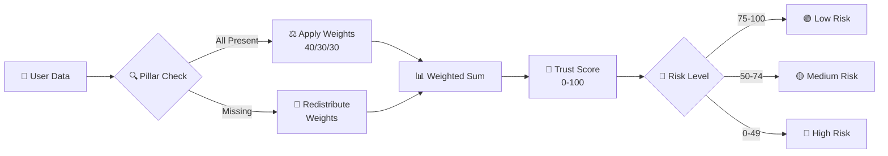

<div align="center">

# 🏆 TrustScore

### *Credit-Invisible Scoring Engine*


<br/>

[](https://developer.mozilla.org/en-US/docs/Web/HTML)
[](https://developer.mozilla.org/en-US/docs/Web/CSS)
[](https://developer.mozilla.org/en-US/docs/Web/JavaScript)
[](https://opensource.org/licenses/MIT)

[](https://github.com/yourusername)
[](http://makeapullrequest.com)
[](#-tech-stack)

<br/>


</div>

---

<div align="center">

## 🎯 What is TrustScore?

</div>

> **TrustScore** is a **lightweight, framework-free web dashboard** that computes a **trust score** for **credit-invisible individuals** — gig workers, freelancers, and small business owners who lack formal credit history.

Instead of relying on traditional credit bureaus, TrustScore analyzes **alternative financial signals** across **three core pillars** to generate a score out of 100, complete with **explainability**, **fraud detection**, and **recommended credit limits**.

<br/>

<div align="center">

### 🌟 The 3 Pillars of Trust

| 🏛️ Pillar | ⚖️ Weight | 📊 What It Measures |
|:---:|:---:|:---|
| 💰 **Money-Flow** | **40%** | Income consistency, savings rate, cash-flow volatility |
| 📜 **Financial History** | **30%** | Repayment history, existing debt, DTI ratio |
| 💼 **Professional Stability** | **30%** | Business/gig stability, growth trajectory, work consistency |

</div>

---

<div align="center">

## ✨ Feature Highlights

</div>

<table>
<tr>
<td width="50%">

### 📊 Interactive Dashboard
Animated **score gauge** with real-time risk level classification (**Low / Medium / High**), plus a dynamically calculated **recommended credit limit**.

### 📈 SVG Cash Flow Chart
Hand-rolled **bar chart** showing 6 months of **income vs. expense** — no chart library needed.

### 🥧 Spending Donut Chart
Category-wise **debit breakdown** rendered as a beautiful **donut chart** with hover tooltips.

</td>
<td width="50%">

### 🕸️ Risk Profile Radar
**6-axis radar chart** comparing the user against a benchmark across income, savings, repayment, debt, stability, and growth.

### 🧠 Explainability Summary
**SHAP-style** positive & negative **driver contributions** — every point of the score is traceable.

### 🚨 Fraud Detection Signals
Real-time **velocity**, **cycle detection**, **peer comparison**, and **anomaly scoring** — all derived from the user's own data.

</td>
</tr>
</table>

<div align="center">

| 🎨 **Gold-on-Dark UI** | 📱 **Fully Responsive** | 🔄 **Multi-User Switcher** | ⚡ **Zero Dependencies** |
|:---:|:---:|:---:|:---:|
| Glassmorphism & gradients | Mobile → Desktop | 3 mock users with loading state | No React, no Vue, no npm |

</div>

---

<div align="center">

## 🖼️ Preview


</div>

---

<div align="center">

## 🚀 Quick Start

</div>

### 📁 File Structure

```bash
trustscore/
├── 📄 index.html      # HTML structure
├── 🎨 style.css       # All styling
├── ⚙️  script.js       # Scoring logic + rendering
└── 📖 README.md       # This file
```

### ▶️ Run Locally

<table>
<tr>
<td>

**Option 1 – Just Open It**

```bash
# Double-click index.html
# or drag it into your browser
```

</td>
<td>

**Option 2 – Serve Locally**

```bash
python -m http.server 8000
# Open http://localhost:8000
```

</td>
</tr>
</table>

> ⚡ **No build step. No npm install. No bundler. Just open and go.**

---

<div align="center">

## 🧠 How Scoring Works

</div>



### 🧮 The Formula

```javascript
// Effective weights (with cold-start redistribution)
const weights = getEffectiveWeights(pillars);

// Weighted sum
let trustScore = 0;
for (const pillar of Object.keys(PILLAR_WEIGHTS)) {
    trustScore += pillars[pillar] * (weights[pillar] / 100);
}
return Math.round(trustScore);
```

### 🚦 Risk Level Derivation

| 🎯 Score Range | 🚦 Risk Level | 🎨 Badge Color |
|:---:|:---:|:---:|
| **75 – 100** | 🟢 **Low** | Green |
| **50 – 74** | 🟡 **Medium** | Yellow |
| **0 – 49** | 🔴 **High** | Red |

---

<div align="center">

## 🎭 Meet the Mock Users

</div>

<table>
<tr>
<th>🆔 ID</th>
<th>👤 Name</th>
<th>💼 Occupation</th>
<th>🔒 Credit-Invisible?</th>
<th>📊 Score</th>
</tr>
<tr>
<td align="center"><code>U-001</code></td>
<td><b>Priya Sharma</b></td>
<td>🛵 Gig Worker (Delivery)</td>
<td align="center">✅ Yes</td>
<td align="center"><b>~72</b></td>
</tr>
<tr>
<td align="center"><code>U-002</code></td>
<td><b>Rahul Verma</b></td>
<td>🏪 Small Business (Kirana)</td>
<td align="center">❌ No</td>
<td align="center"><b>~60</b></td>
</tr>
<tr>
<td align="center"><code>U-003</code></td>
<td><b>Sunita Patel</b></td>
<td>🎨 Freelance Designer</td>
<td align="center">✅ Yes</td>
<td align="center"><b>~85</b></td>
</tr>
</table>

Each user includes:
- 🏛️ `pillars` — the 3 scoring dimensions
- 💡 `reasons` — explainability factors with `contribution` values
- 💳 `transactions` — full credit/debit history
- 📈 `monthlyFlow` — 6 months of income vs. expense
- 🛵 `gigStats` — optional gig-economy metrics

---

<div align="center">

## 🛠️ Tech Stack

</div>

<div align="center">

| Layer | Technology | Purpose |
|:---:|:---:|:---|
| 📄 **Markup** | HTML5 | Semantic structure |
| 🎨 **Styling** | CSS3 | Custom properties, Grid, Flexbox, `backdrop-filter` |
| ⚙️ **Logic** | Vanilla JavaScript (ES5) | Pure DOM manipulation, no framework |
| 📊 **Charts** | Hand-rolled SVG | Bar, Donut, Radar — no library |
| 🔤 **Fonts** | Google Fonts – Inter | Modern typography |
| 📦 **Dependencies** | **None** ✅ | Zero npm, zero bundler |

</div>

---

<div align="center">

## 🎨 Design Principles

</div>

<table>
<tr>
<td align="center" width="20%">

### 🚫📦
**No Framework**
<br/>
<sub>Pure DOM, no React/Vue</sub>

</td>
<td align="center" width="20%">

### 📊🎨
**No Chart Library**
<br/>
<sub>Charts as SVG strings</sub>

</td>
<td align="center" width="20%">

### 🎯1️⃣
**Single Source of Truth**
<br/>
<sub>Score always derived</sub>

</td>
<td align="center" width="20%">

### 🧠💡
**Explainability First**
<br/>
<sub>Every score is traceable</sub>

</td>
<td align="center" width="20%">

### 🔄⚖️
**Graceful Degradation**
<br/>
<sub>Missing data → redistribute</sub>

</td>
</tr>
</table>

---

<div align="center">

## 🔍 Key Code Snippets

</div>

### 🧮 Compute Trust Score

```javascript
function computeTrustScore(pillars) {
    const weights = getEffectiveWeights(pillars);
    const score = Object.keys(PILLAR_WEIGHTS).reduce((sum, k) => {
        const value = pillars[k];
        if (value == null) return sum;
        return sum + value * (weights[k] / 100);
    }, 0);
    return Math.round(score);
}
```

### 🚨 Fraud Indicators

```javascript
function computeFraudIndicators(user, allUsers) {
    // 🔍 Velocity, 🔄 Cycle Detection,
    // 👥 Peer Comparison, ⚠️ Anomaly Score
    // All derived from the user's own data
}
```

---

<div align="center">

## 🧪 Testing Checklist

</div>

- [x] 🔄 Switch between all 3 users — data updates correctly
- [x] 📑 Click tabs (**Dashboard / Transactions / Insights**)
- [x] 🔍 Filter transactions (**All / Credits / Debits**)
- [x] 🎚️ Toggle **"Show details"** in Explainability
- [x] 📱 Resize browser — layout remains responsive
- [x] 🎬 Score gauge animates on load

---

<div align="center">

## 🚧 Roadmap

</div>

```mermaid
timeline
    title TrustScore Development Timeline
    section Phase 1 : Prototype
        Mock Data : Done
        Scoring Logic : Done
        SVG Charts : Done
    section Phase 2 : Backend
        REST API : Planned
        Database : Planned
        Auth : Planned
    section Phase 3 : Intelligence
        ML Model : Planned
        Gradient Boosting : Planned
        Real-time Signals : Planned
    section Phase 4 : Scale
        i18n : Planned
        PDF Export : Planned
        Mobile App : Planned
```

---

<div align="center">

## 📜 License

</div>

<div align="center">

**MIT License** — free to use, modify, and distribute.

```
Copyright (c) 2026 TrustScore Team

Permission is hereby granted, free of charge, to any person obtaining a copy
of this software and associated documentation files (the "Software"), to deal
in the Software without restriction, including without limitation the rights
to use, copy, modify, merge, publish, distribute, sublicense, and/or sell
copies of the Software.
```

</div>

---

<div align="center">

## 🙌 Acknowledgements

</div>

<div align="center">

| 💡 Inspiration | 🎨 Design | 🏗️ Built For |
|:---:|:---:|:---:|
| Credit-invisible populations in emerging markets | Modern fintech dashboards | Hackathons & financial inclusion demos |

</div>

---

<div align="center">

## 📬 Contact

**Your Name**

[](mailto:your.email@example.com)
[](https://linkedin.com/in/yourprofile)
[](https://github.com/yourusername)

</div>

---

<div align="center">

### 💛 *"Financial inclusion starts with visibility."*

**⭐ Star this repo if you found it useful!**


</div>
